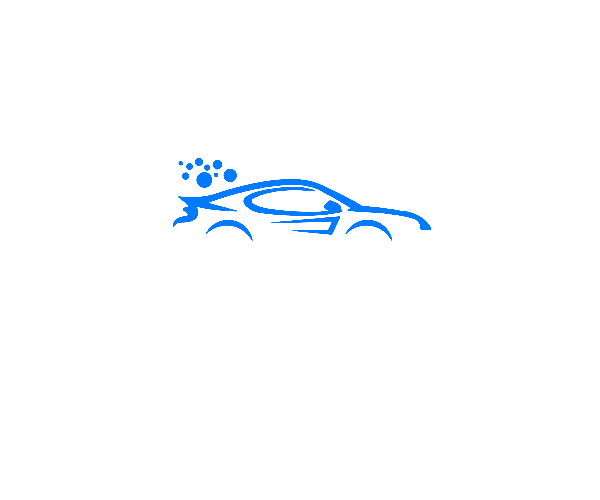

<p align="center">
  
</p>

<h1 align="center">CleanMyCar</h1>

<p align="center">
  🚗 A simple and efficient web platform for managing car cleaning services. <br/>
  Book, schedule, and manage car cleaning appointments with ease.
</p>

---

## 🧼 Features

- User-friendly booking system
- Admin dashboard to manage appointments
- Service history tracking
- Email notifications
- Mobile-responsive UI

## 🚀 Tech Stack

- **Frontend:** HTML, CSS, JavaScript
- **Backend:** PHP (using XAMPP)
- **Database:** MySQL
- **Other:** Git, GitHub

## 📷 Screenshots


```markdown


📦 Installation

git clone https://github.com/your-username/CleanMyCar.git
cd CleanMyCar
# Move to XAMPP's htdocs folder if needed
Import the database (cleanmycar.sql) into phpMyAdmin.

Configure database credentials in config.php.

✅ How to Use
Start Apache and MySQL from XAMPP.

Navigate to http://localhost/CleanMyCar/.

Register or login and start booking services!

🙋‍♂️ Author
Jawher Ayari
@jawh3

📄 License
This project is licensed under the MIT License — see the LICENSE file for details.